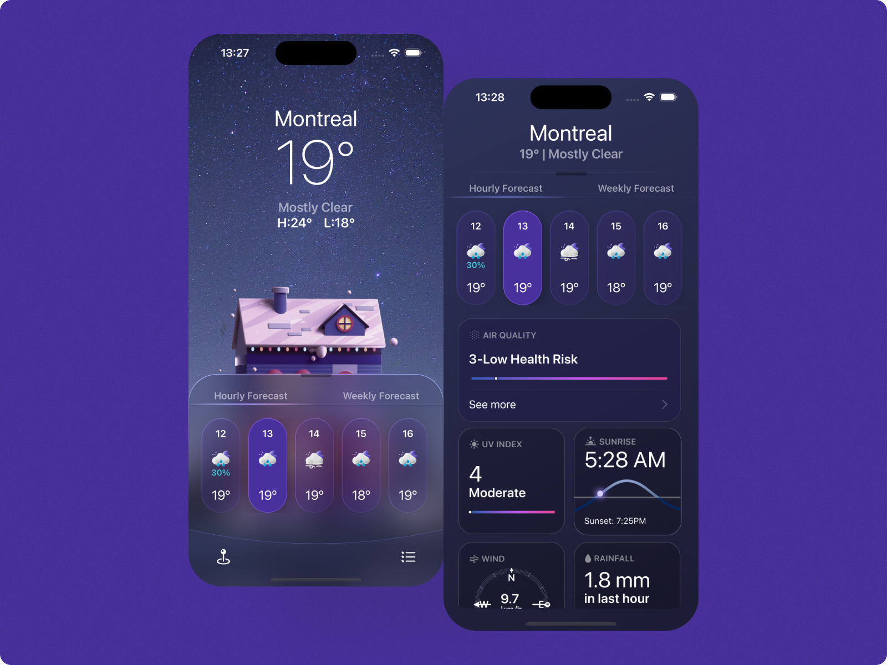

<h1>Weather</h1>

⛈️ Application to check the weather ⛈️

    
     
  

<h1>📃 About</h1>

Welcome to MyWeather, the ultimate iOS app that provides you with real-time weather updates and forecasts right at your fingertips. With its sleek design, user-friendly interface, and powerful features, MyWeather ensures you stay informed about the weather conditions no matter where you are. Whether you're planning a trip, getting ready for a daily commute, or simply curious about the current weather, MyWeather has got you covered. Let's explore the features and benefits of this exceptional weather app.

<h1>🚀 Technologies</h1>
<a href="https://docs.swift.org/swift-book/">Swift</a>

Made with 💜 by <a href="https://www.linkedin.com/in/gustavo-castilho-914a621b4/">Gustavo Castilho</a>
